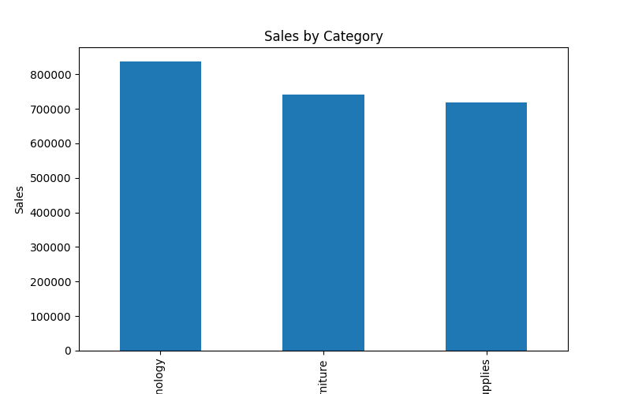
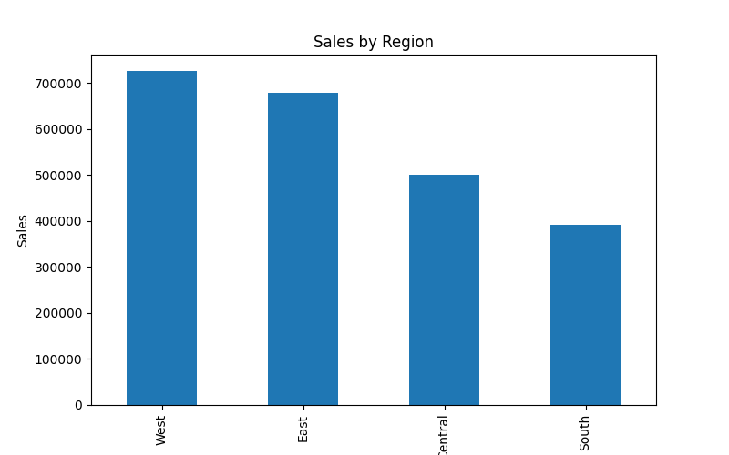
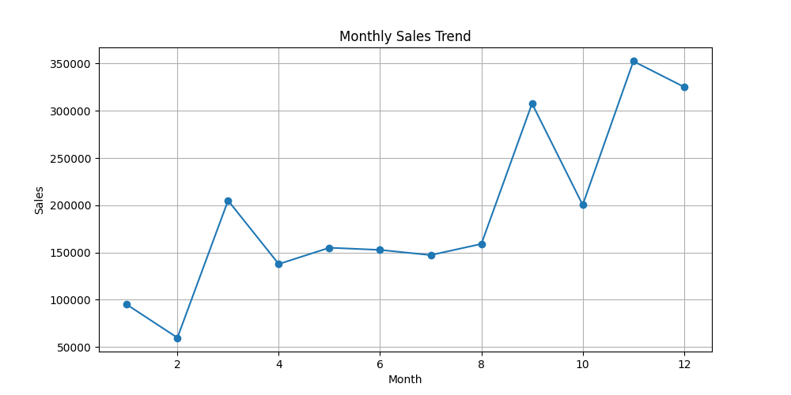
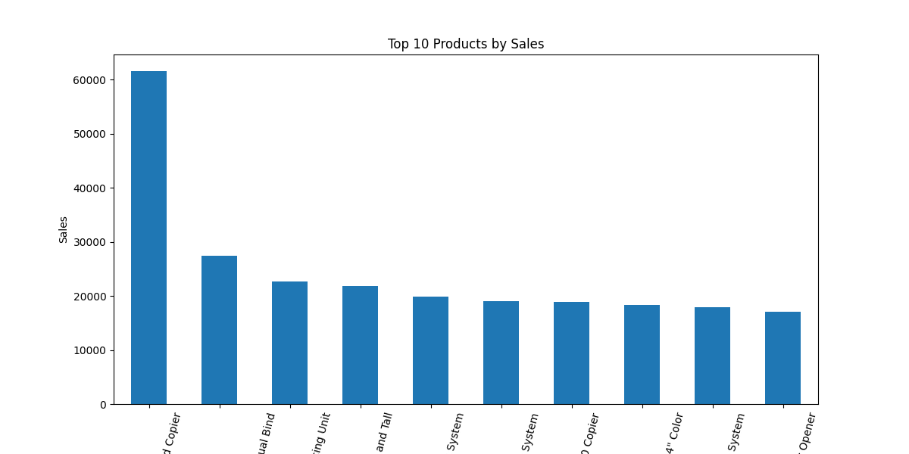
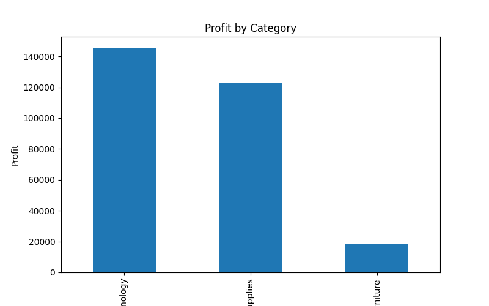
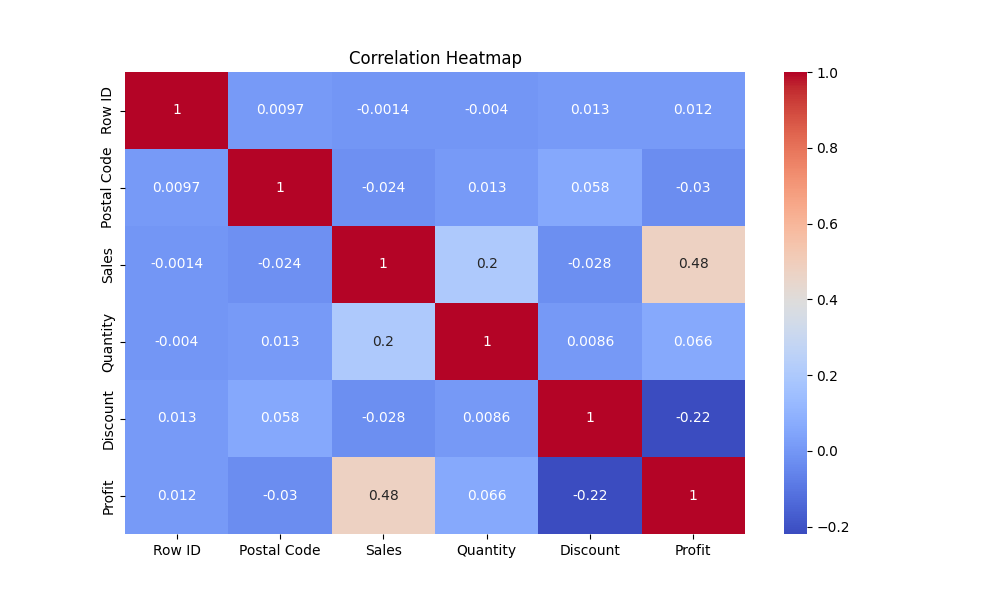
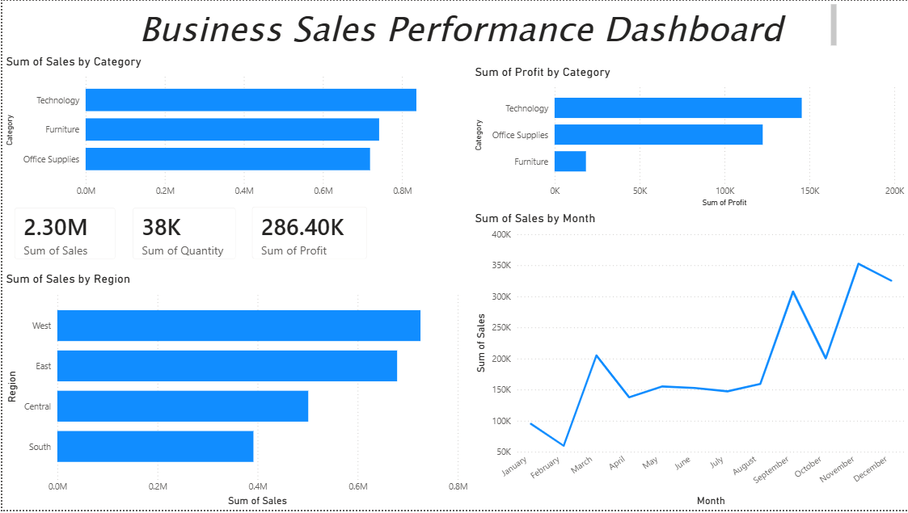

# FUTURE_DS_01
Data Analysis Task
# Business Sales Performance Analytics

## Project Overview
This project analyzes business sales data to identify:
- Revenue trends
- Top-selling products
- Regional sales performance
- Category-wise profit
- Business insights for decision-making

The analysis was performed using Python, Pandas, Matplotlib, and Seaborn.

---

## Tools & Technologies Used
- Python
- Pandas
- NumPy
- Matplotlib
- Seaborn
- Jupyter Notebook
- VS Code

---

## Dataset
Superstore Sales Dataset

---

## Project Workflow
1. Data Cleaning
2. Exploratory Data Analysis (EDA)
3. Sales Trend Analysis
4. Profit Analysis
5. Regional Performance Analysis
6. Correlation Analysis
7. Visualization & Reporting

---

## Key Insights
- Technology category generated the highest sales.
- Some products generated high sales but low profit.
- Regional sales performance varied significantly.
- Monthly sales trends revealed seasonal business patterns.
- Certain products caused major losses and need business review.

---

## Visualizations

### Sales by Category

### Sales by Region

### Monthly Sales Trend

### Top Products

### Profit Analysis

### Correlation Heatmap

---
## Power BI Dashboard

## Conclusion
This project demonstrates practical business analytics skills including:
- data cleaning,
- visualization,
- KPI analysis,
- insight generation,
- and business reporting.

The analysis helps organizations make better strategic and operational decisions.
